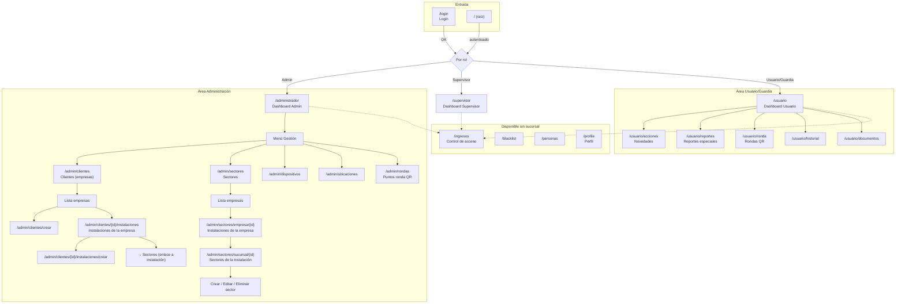

# Diagrama y explicación del sistema de base de datos – web-seguridad

Documento para tener claro cómo funciona toda la base de datos y poder explicarlo a ChatGPT al reestructurar o agregar funcionalidades.

---

## 1. Diagrama ER (entidades y relaciones)

```mermaid
erDiagram
    %% ─── Núcleo: jerarquía empresa → instalaciones (sucursales) ───
    empresas ||--o{ sucursales : "tiene"
    sucursales ||--o{ usuarios : "tiene"
    sucursales ||--o{ sectores : "tiene"
    sucursales ||--o{ puntos_ronda : "tiene"
    sucursales ||--o{ ubicaciones_permitidas : "tiene"
    sucursales ||--o{ personas : "asociada"
    
    roles_usuario ||--o{ usuarios : "tiene"
    rol_permiso }o--|| roles_usuario : "rol"
    rol_permiso }o--|| permisos : "permiso"
    
    usuarios ||--o{ sesiones : "tiene"
    usuarios ||--o{ documentos : "tiene"
    usuarios ||--o{ dias_trabajados : "tiene"
    usuarios ||--o{ reuniones : "crea"
    usuarios ||--o{ reportes : "crea"
    usuarios ||--o{ acciones : "crea"
    usuarios ||--o{ reportes_especiales : "crea"
    usuarios ||--o{ escaneos_ronda : "realiza"
    usuarios ||--o{ ingresos : "registra_guardia"
    usuarios ||--o{ blacklists : "creado_por"
    usuarios ||--o| documentos : "aprobado_por"
    
    %% Reportes y tareas
    tareas ||--o{ reportes : "tipo"
    tareas ||--o{ detalles_tarea : "campos"
    reportes ||--o{ informes : "genera"
    reportes }o--o| usuarios : "leido_por"
    
    %% Acciones y reportes especiales
    acciones }o--o| reportes_especiales : "elevado_a"
    sectores }o--o| acciones : "sector"
    sectores }o--o| reportes_especiales : "sector"
    sucursales ||--o{ acciones : "sucursal"
    sucursales ||--o{ reportes_especiales : "sucursal"
    
    grupos_incidentes ||--o{ tipos_incidente : "tiene"
    tipos_incidente }o--o| reportes_especiales : "tipo_incidente"
    
    %% Rondas QR
    puntos_ronda ||--o{ escaneos_ronda : "escaneado_en"
    sectores }o--o| puntos_ronda : "sector"
    
    %% Control de acceso
    blacklists : id
    blacklists : rut
    blacklists : patente
    blacklists : motivo
    blacklists : activo
    
    ingresos : id
    ingresos : tipo
    ingresos : rut
    ingresos : id_guardia
    ingresos : fecha_ingreso
    ingresos : fecha_salida
    ingresos : alerta_blacklist
    
    %% Catálogos y config
    feriados : id
    feriados : fecha
    feriados : nombre
    configuraciones_sueldo : id
    configuraciones_sueldo : tipo_dia
    configuraciones_sueldo : multiplicador
    dispositivos_permitidos : id
    dispositivos_permitidos : browser_fingerprint
    tokens_recuperacion : email
    tokens_recuperacion : token
    
    empresas {
        bigint id PK
        string nombre
        string codigo UK
        string razon_social
        string rut
        boolean activa
    }
    
    sucursales {
        bigint id PK
        bigint empresa_id FK
        string nombre
        string codigo UK
        string ciudad
        string region
        boolean activa
    }
    
    usuarios {
        bigint id_usuario PK
        string run UK
        string nombre_completo
        string rango
        string email
        string clave
        bigint rol_id FK
        bigint sucursal_id FK
        string browser_fingerprint
        boolean dispositivo_verificado
    }
    
    roles_usuario {
        bigint id PK
        string nombre
        string slug UK
    }
    
    permisos {
        bigint id PK
        string nombre
        string slug UK
    }
    
    rol_permiso {
        bigint id PK
        bigint rol_id FK
        bigint permiso_id FK
    }
    
    personas {
        bigint id PK
        string rut UK
        string nombre
        bigint sucursal_id FK
    }
    
    sectores {
        bigint id PK
        bigint sucursal_id FK
        string nombre
        boolean activo
    }
    
    tareas {
        bigint id PK
        string nombre
        string categoria
        boolean activa
    }
    
    detalles_tarea {
        bigint id PK
        bigint tarea_id FK
        string campo_nombre
        string tipo_campo
        boolean requerido
    }
    
    reportes {
        bigint id PK
        bigint id_usuario FK
        bigint tarea_id FK
        json datos
        json imagenes
        enum estado
        bigint leido_por_id FK
        timestamp fecha_lectura
    }
    
    informes {
        bigint id PK
        bigint reporte_id FK
        integer numero_informe UK
        text descripcion
        string estado
    }
    
    acciones {
        bigint id PK
        bigint id_usuario FK
        bigint sucursal_id FK
        bigint sector_id FK
        enum tipo
        string tipo_hecho
        string importancia
        date dia
        time hora
        text novedad
        text accion
        text resultado
    }
    
    reportes_especiales {
        bigint id PK
        bigint id_usuario FK
        bigint accion_id FK
        bigint sucursal_id FK
        bigint sector_id FK
        bigint tipo_incidente_id FK
        enum tipo
        date dia
        time hora
        enum estado
        bigint leido_por_id FK
        timestamp fecha_lectura
    }
    
    grupos_incidentes {
        bigint id PK
        string nombre
        string slug UK
        boolean activo
    }
    
    tipos_incidente {
        bigint id PK
        bigint grupo_id FK
        string nombre
        string slug
    }
    
    puntos_ronda {
        bigint id PK
        bigint sucursal_id FK
        bigint sector_id FK
        string nombre
        string codigo UK
        decimal lat
        decimal lng
        int distancia_maxima_metros
    }
    
    escaneos_ronda {
        bigint id PK
        bigint punto_ronda_id FK
        bigint id_usuario FK
        timestamp escaneado_en
    }
    
    documentos {
        bigint id PK
        bigint id_usuario FK
        enum tipo_documento
        enum estado
        bigint aprobado_por FK
    }
    
    reuniones {
        bigint id PK
        string titulo
        bigint id_usuario_creador FK
        string estado
    }
    
    sesiones {
        string id PK
        bigint user_id FK
        longText payload
        int last_activity
    }
    
    dias_trabajados {
        bigint id PK
        bigint id_usuario FK
        date fecha
        decimal ponderacion
    }
    
    ubicaciones_permitidas {
        bigint id PK
        string nombre
        decimal latitud
        decimal longitud
        int radio
        bigint sucursal_id FK
    }
```

---

## 2. Resumen por bloques (para explicar a ChatGPT)

### 2.1 Organización y usuarios

- **sucursales**: Sedes/plantas (nombre, código, dirección, ciudad, región, activa). Es el eje territorial.
- **usuarios**: Guardias y personal (PK `id_usuario`, identificador `run`). Tienen `rol_id`, `sucursal_id`, `email`, `clave`, `browser_fingerprint`, `dispositivo_verificado`.
- **roles_usuario**: ADMIN, SUPERVISOR, USUARIO, GUARDIA, etc. (nombre, slug).
- **permisos** + **rol_permiso**: Permisos por rol (tabla pivot rol ↔ permiso).
- **personas**: Base de personas por RUT (nombre, teléfono, email, empresa, notas). Opcionalmente `sucursal_id`. Se usa para completar datos desde escáner/control de acceso.
- **sesiones**: Sesiones de Laravel; `user_id` apunta a `usuarios.id_usuario`.
- **tokens_recuperacion**: Recuperación de contraseña (email, token).

### 2.2 Reportes “normales” (por tareas)

- **tareas**: Tipos de reporte (nombre, categoría, icono, color). Ej: novedades_servicio.
- **detalles_tarea**: Campos dinámicos por tarea (campo_nombre, tipo_campo, opciones, requerido, orden).
- **reportes**: Cada reporte es de un **usuario** y de una **tarea**. Lleva `datos` (JSON), `imagenes` (JSON), lat/long, `estado` (pendiente, en_revision, completado, rechazado), `comentarios_admin`, `leido_por_id`, `fecha_lectura`.
- **informes**: Informes formales asociados a un **reporte** (numero_informe, descripcion, lesionados, acciones_inmediatas, conclusiones, fotografías, estado, aprobación).

### 2.3 Acciones / novedades de servicio

- **acciones**: Registro de lo que hace el usuario en turno (inicio_servicio, rondas, constancias, concurrencia_autoridades, concurrencia_servicios, entrega_servicio). Por **usuario**, **sucursal** y opcional **sector**. Incluye `dia`, `hora`, `novedad`, `accion`, `resultado`, imágenes, coordenadas. Tienen **tipo_hecho** (incidente, observación, información, delito, accidente) e **importancia** (importante, cotidiana, crítica).
- **sectores**: Zonas dentro de una sucursal (nombre, descripción, activo). Pertenece a **sucursal**.

### 2.4 Reportes especiales (incidentes, denuncias, etc.)

- **reportes_especiales**: Similar a acciones pero con `tipo` (incidentes, denuncia, detenido, accion_sospechosa), `estado` (pendiente, en_revision, completado, rechazado), `comentarios_admin`, `leido_por_id`, `fecha_lectura`. Pueden tener **accion_id** (elevación desde una acción) y **tipo_incidente_id**.
- **grupos_incidentes** y **tipos_incidente**: Catálogo de incidentes (grupo → varios tipos). `reportes_especiales.tipo_incidente_id` → `tipos_incidente.id`.

### 2.5 Rondas QR

- **puntos_ronda**: Puntos a escanear por sucursal (y opcional sector). Tienen `codigo` (QR), `nombre`, `lat`, `lng`, `distancia_maxima_metros`, `orden`, `activo`.
- **escaneos_ronda**: Cada escaneo: **punto_ronda**, **usuario**, `escaneado_en`, lat/lng.

### 2.6 Control de acceso e ingresos

- **ingresos**: Registro de ingresos/salidas (peatonal o vehicular). `rut`, `nombre`, `patente` (opcional), `id_guardia` (usuario), `fecha_ingreso`, `fecha_salida`, `estado`, `alerta_blacklist`.
- **blacklists**: RUT o patente bloqueados (motivo, fechas, activo, creado_por usuario).

### 2.7 Documentos y reuniones

- **documentos**: Documentos del usuario (cédula, licencia, certificados). `id_usuario`, `tipo_documento`, imágenes, `estado` (pendiente, aprobado, rechazado), `aprobado_por`, `documento_anterior_id` para cambios.
- **reuniones**: Reuniones (título, descripción, fecha_reunion, ubicación, `id_usuario_creador`, estado).

### 2.8 Sueldos y días trabajados

- **dias_trabajados**: Días trabajados por usuario (fecha, ponderación, observaciones). Único (id_usuario, fecha).
- **configuraciones_sueldo**: Multiplicadores por tipo de día (tipo_dia, multiplicador).
- **feriados**: Fechas de feriados (nombre, fecha, irrenunciable, activo).

### 2.9 Seguridad y restricciones

- **dispositivos_permitidos**: `browser_fingerprint` permitidos (descripción, activo, requiere_ubicacion). No hay FK a usuario; se valida por fingerprint.
- **ubicaciones_permitidas**: Polígonos/círculos permitidos (nombre, latitud, longitud, radio, opcional `sucursal_id`).

---

## 3. Relaciones clave (para reestructurar)

| Tabla origen      | FK / relación                    | Tabla destino      |
|-------------------|-----------------------------------|--------------------|
| usuarios          | rol_id, sucursal_id               | roles_usuario, sucursales |
| reportes          | id_usuario, tarea_id, leido_por_id| usuarios, tareas, usuarios |
| informes          | reporte_id                        | reportes           |
| acciones          | id_usuario, sucursal_id, sector_id| usuarios, sucursales, sectores |
| reportes_especiales| id_usuario, accion_id, sucursal_id, sector_id, tipo_incidente_id, leido_por_id | usuarios, acciones, sucursales, sectores, tipos_incidente, usuarios |
| escaneos_ronda    | punto_ronda_id, id_usuario        | puntos_ronda, usuarios |
| puntos_ronda      | sucursal_id, sector_id            | sucursales, sectores |
| sectores          | sucursal_id                       | sucursales         |
| ingresos          | id_guardia                        | usuarios           |
| documentos        | id_usuario, aprobado_por          | usuarios           |
| blacklists        | creado_por                        | usuarios           |
| personas          | sucursal_id                       | sucursales         |
| dias_trabajados   | id_usuario                        | usuarios           |
| reuniones         | id_usuario_creador                | usuarios           |
| ubicaciones_permitidas | sucursal_id                  | sucursales         |
| sucursales             | empresa_id                   | empresas           |

---

## 4. Diseño de vistas y cómo se conectan

Esta sección describe las vistas de la aplicación y las conexiones entre ellas (navegación y flujos).

### 4.1 Diagrama de flujo de vistas (navegación principal)



### 4.2 Resumen de vistas por área

| Área | Ruta base | Vista / propósito | Conexiones salientes típicas |
|------|-----------|-------------------|------------------------------|
| **Auth** | `/login` | Formulario de login | → `/` (por rol: administrador, supervisor, usuario) |
| **Raíz** | `/` | Redirección por rol | → administrador, supervisor o usuario |
| **Perfil** | `/profile` | Ver/editar perfil y contraseña | Misma vista, sin flujo a otras áreas |
| **Control de acceso** | `/ingresos`, `/ingresos/escaner`, `/ingresos/entrada-manual` | Listado ingresos, escáner, entrada manual | → ingresos/{id}, blacklist, personas |
| **Personas** | `/personas` | CRUD base de personas (RUT) | crear, editar, listado |
| **Blacklist** | `/blacklist` | Listar/gestionar RUT/patentes bloqueados | Misma vista |
| **Usuario** | `/usuario` | Dashboard usuario/guardia | acciones, reportes, ronda, historial, documentos |
| **Usuario acciones** | `/usuario/acciones`, crear, ver | Novedades del servicio | crear → listado → ver detalle |
| **Usuario reportes** | `/usuario/reportes`, crear, ver | Reportes especiales | crear → listado → ver detalle |
| **Usuario ronda** | `/usuario/ronda`, `/usuario/ronda/escaner` | Rondas QR y escáner | escanear QR → registro en escaneos_ronda |
| **Supervisor** | `/supervisor` | Dashboard supervisor | documentos (aprobación) |
| **Admin** | `/administrador` | Dashboard administrador | usuarios, documentos, reportes-diarios, calculo-sueldos, reporte-sucursal, Gestión |
| **Admin – Clientes** | `/admin/clientes` | Lista empresas | Nueva empresa → crear/editar; por empresa → Instalaciones |
| **Admin – Clientes instalaciones** | `/admin/clientes/{id}/instalaciones` | Lista instalaciones de una empresa | Nueva instalación → crear/editar; Sectores (N) → vista Sectores de esa instalación |
| **Admin – Sectores** | `/admin/sectores` | Lista empresas (para sectores) | Por empresa → Instalaciones de la empresa |
| **Admin – Sectores por empresa** | `/admin/sectores/empresa/{id}` | Instalaciones de la empresa | Por instalación → Sectores de la instalación |
| **Admin – Sectores por instalación** | `/admin/sectores/sucursal/{id}` | CRUD sectores de una instalación | Crear sector, editar, eliminar, toggle |
| **Admin – Otros** | dispositivos, ubicaciones, rondas, novedades, reportes-especiales, etc. | Gestión de dispositivos, ubicaciones, puntos ronda, novedades, reportes | Enlaces desde dashboard o menú Gestión |

### 4.3 Conexiones entre vistas clave

- **Clientes ↔ Instalaciones ↔ Sectores**
  - **Clientes** (`/admin/clientes`): lista empresas. Desde cada empresa se va a **Instalaciones** de esa empresa (`/admin/clientes/{empresa}/instalaciones`).
  - **Instalaciones**: desde cada instalación se puede ir a **Sectores** de esa instalación (`/admin/sectores/sucursal/{sucursal}`), que es la misma vista que se usa en el flujo de Sectores.
  - **Sectores** (`/admin/sectores`): lista empresas. Al elegir una empresa se va a **Instalaciones de la empresa** (`/admin/sectores/empresa/{empresa}`). Desde ahí se elige una instalación y se abre **Sectores de la instalación** (`/admin/sectores/sucursal/{sucursal}`), donde se hace el CRUD de sectores.

- **Menú Gestión (Admin)**  
  Bajo el ítem **Gestión** del menú: **Clientes**, **Dispositivos**, **Ubicaciones**, **Sectores**, **Puntos de ronda (QR)**. Cada uno lleva a su listado o flujo; Sectores y Clientes comparten el concepto de empresa/instalación como se indicó arriba.

- **Usuario**  
  El dashboard usuario enlaza a: Acciones (novedades), Reportes (especiales), Ronda (QR), Historial, Documentos. Las vistas de detalle (ver acción, ver reporte, etc.) suelen volver al listado o al dashboard.

- **Control de acceso**  
  Ingresos, Blacklist y Personas son accesibles desde el menú sin exigir sucursal; se usan para registrar entradas/salidas y mantener la base de personas y bloqueos.

- **Tablas relacionadas con las vistas**
  - **Clientes / Instalaciones** → tablas `empresas`, `sucursales` (`empresa_id`).
  - **Sectores** → tabla `sectores` (`sucursal_id`).
  - **Acciones / Novedades** → tabla `acciones` (usuario, sucursal, sector).
  - **Reportes especiales** → tabla `reportes_especiales`.
  - **Rondas** → tablas `puntos_ronda`, `escaneos_ronda`.
  - **Ingresos / Personas / Blacklist** → tablas `ingresos`, `personas`, `blacklists`.

---

## 5. Cómo usar este documento con ChatGPT

1. **Copia todo este archivo** (o las secciones que necesites) y pégalo en ChatGPT.
2. **Añade al inicio** algo como: “Este es el esquema actual de mi base de datos, las tablas y cómo se conectan las vistas.”
3. **Sección 1**: diagrama ER (tablas). **Sección 4**: diseño de vistas y conexiones entre pantallas (flujo Clientes → Instalaciones → Sectores, menú Gestión, usuario, etc.).
4. **Luego indica** qué quieres agregar o reestructurar (ej: “quiero agregar X entidad”, “unificar reportes y reportes_especiales”, “añadir una vista de X”, etc.).
5. Si ChatGPT te pide el diagrama en otro formato, puedes usar los **bloques Mermaid** (sección 1: ER; sección 4: flujo de vistas) en [mermaid.live](https://mermaid.live) para exportar a imagen y adjuntarla, o dejar el texto Mermaid en el chat.

Con esto ChatGPT tendrá claro cómo funciona toda tu base de datos, el diseño de las vistas y sus conexiones, y podrá proponer reestructuraciones coherentes con lo que ya tienes.
